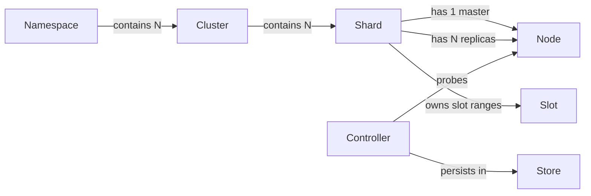
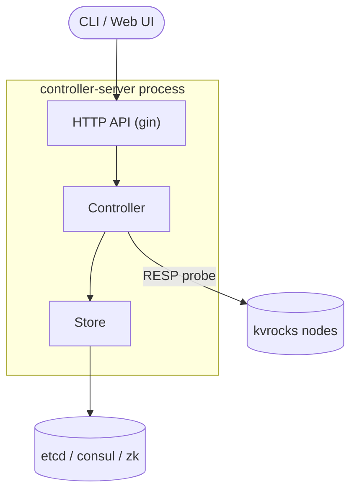
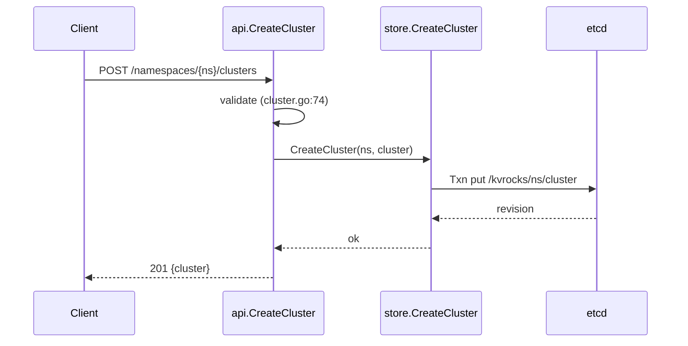
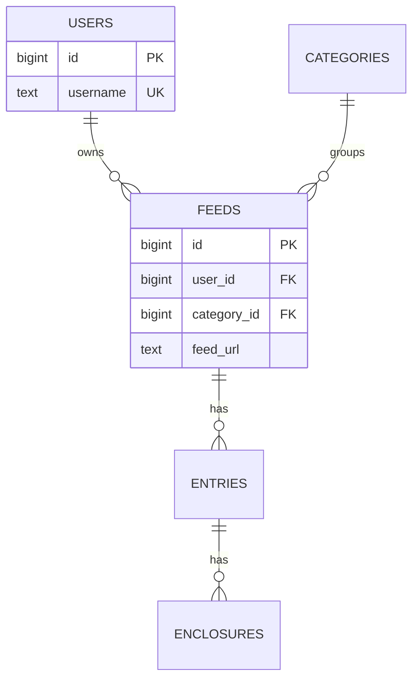
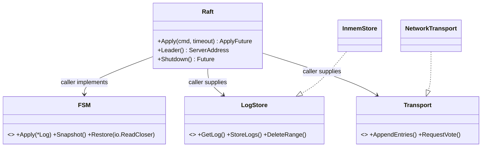
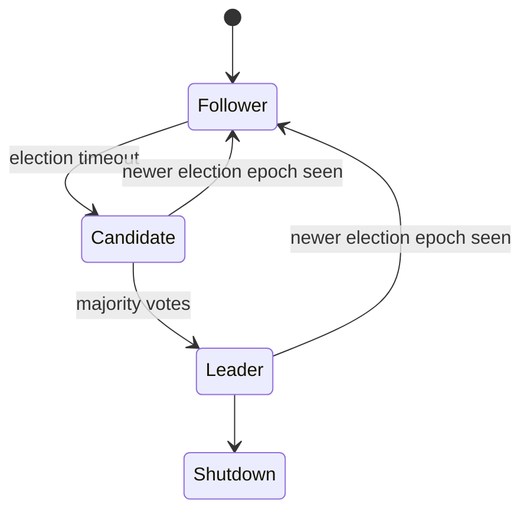

# Mermaid conventions

One idea per diagram, at most ~12 nodes; split rather than cram. Every node label is a glossary
concept or a real symbol from the code, never a paraphrase. Put the citation for each diagram in a
line under it, not inside the labels (Mermaid chokes on `:` and `/` in labels — quote them:
`A["server/route.go"]`).

## Concept relationship map — `flowchart`

Edges carry the relationship *and* cardinality. Direction is owner → owned or producer → consumer.

## Architecture — `flowchart` with subgraphs

One subgraph per process. Externals are cylinders `[( )]`; entry points are stadiums `([ ])`.
In-process arrows are call direction; cross-process arrows say the protocol.

## Data flow — `sequenceDiagram`

Participants are components from the architecture diagram; arrow labels name the function. Use
`alt` / `loop` for retries and error branches only when they matter to the flow's guarantee.

## Schema — `erDiagram`

Show keys and the columns that appear in the flows; omit the rest. For KV / coordination stores
use a table of key prefixes instead:

| Key pattern | Value | Written by | Read by | Consistency |
| --- | --- | --- | --- | --- |
| `/kvrocks/<ns>/<cluster>` | Cluster JSON | `store.CreateCluster` | `controller.loadCluster` | etcd Txn, watched |

## Library interfaces — `classDiagram`

Mark caller-implemented interfaces explicitly; that split is the first thing a library user needs.

## Internal state — `stateDiagram-v2`

Use for state machines that the API's guarantees depend on.
